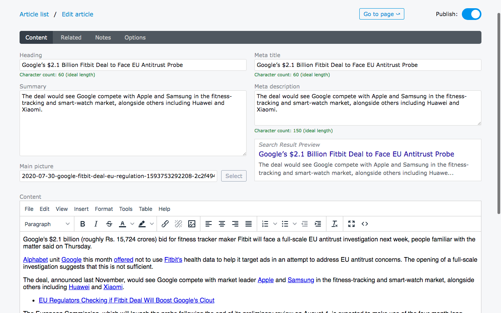

EmbedBlog is a LAMP based blog module that can be embedded in a static PHP site. It is based on the blog codebase used on www.itefy.com/blog/

## Features
* Dynamic, lightweight AJAX based admin interface
* Separate content and meta information
* Heading, summary, main picture and content editor (TinyMCE)
* Automatic image resizing and compressing to both thumbnail and full image
* Image picker with batch image uploading and processing
* Image picker shows only the current blog post images
* Publish and unpublish articles
* Per blog post URL path customization
* SCSS and JS source code included

### Requirements
* PHP 7.* with GD (may work with PHP 5.x also, but untested)
* Apache webserver (can run on Nginx as well, but you'll need to change the .htaccess rewrite)
* MySQL or MariaDB
* You should be familiar with PHP programming and SQL in order to install or upgrade the blog system.

### Installation

1. Upload the www/blog/ folder directly to your public site folder (usually called www, public_html etc.). You should now have a blog folder located directly under the www root.
2. Rename or copy _htaccess to .htaccess
3. Rename or copy config.sample.php to config.php
4. Create a database, and import the database.sql file. Create a database user that has all the privileges to the database.
5. Edit the config.php file with the database server, username, password and database name. You can change other params as well.
6. CHMOD /www/blog/img/ to 0755 in order to be able to upload images

### Create an admin user
Before you can log into admin and create a blog post, you must add at least one admin user to your database:

1. Encrypt the password (encryption type: DES). You can use an online site like http://www.visiospark.com/password-encryption-tool/ to do so. Copy the DES encrypted password.
2. Log into the database and add a new record to the blog_admins table. The username should be a valid email address (lowercase only) and for the password, paste the encryptet password string into the password column/field. Leave sid and exp untouched.

### Log in
- Go to your website at /blog/admin/
- Log in with the username and password you created in the previous step

### Upgrading with new source code version
If you want to upgrade to a new version of the eBlog system, there are a few best practices to follow:
* Make sure to backup everything inside the blog folder. Also, create a dump of the blog database.
* In most cases it is sufficient to upgrade/replace only the following folders from the new version:
	* /www/blog/admin/
	* /www/blog/logic/
* In some cases, the database structure, config.php and .htaccess has been updated as well. Compare your current config.php and .htaccess file with the new. There are several ways to compare the database structure, but if you're familiar with MySQL queries and dump files, you can make a dump (structure only) of your current database, and compare it with the new database.sql file. https://www.diffchecker.com/ can be a useful tool to compare any changes to the database.

